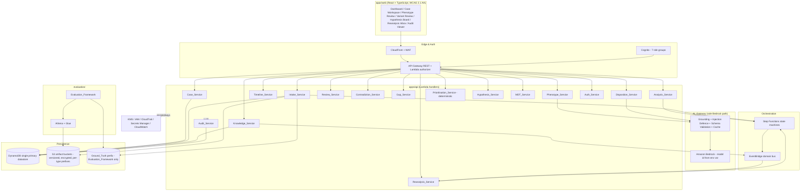
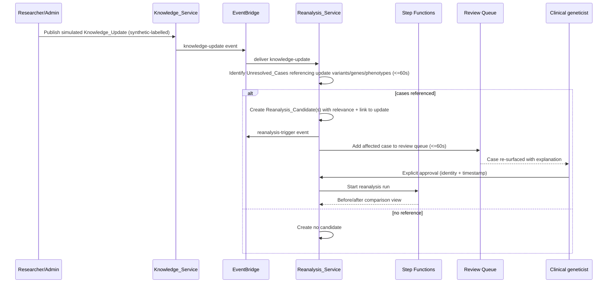
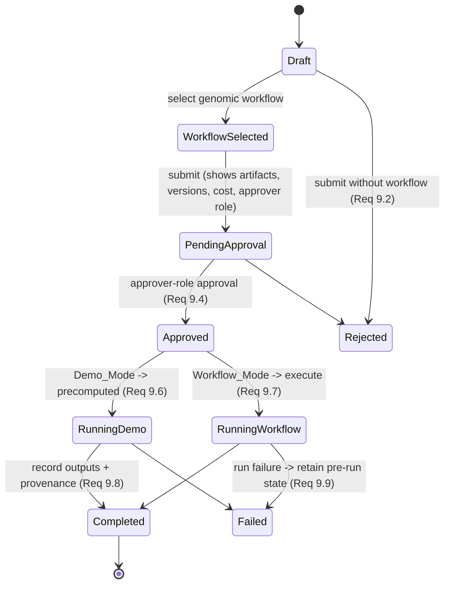
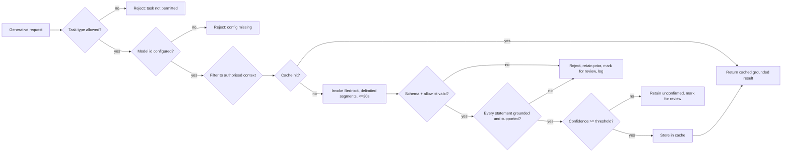
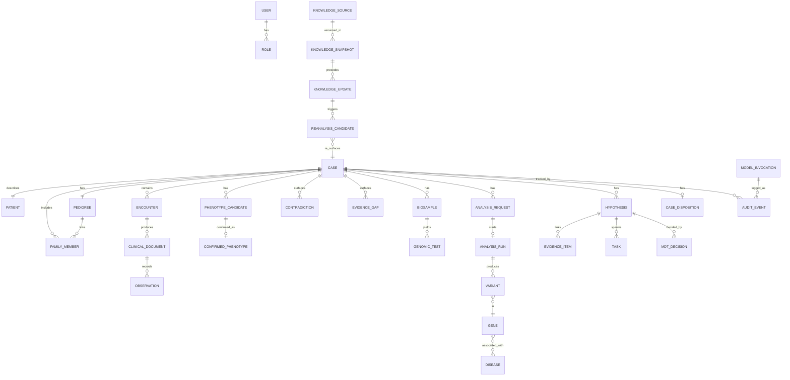

# Design Document: AI-Assisted Undiagnosed Disease Case Navigator

## Overview

The Navigator is a demonstration and research-support system that helps multidisciplinary clinical and research teams investigate undiagnosed disease cases using synthetic data only. It reconstructs longitudinal diagnostic timelines, uses AI (via a controlled gateway) to extract candidate phenotypes and map them to HPO terms under mandatory human review, detects contradictions and evidence gaps, orchestrates human-approved genomic analysis, deterministically prioritises variants and genes, produces evidence-linked hypothesis cards, supports MDT review, and continuously re-evaluates unresolved cases when simulated knowledge updates arrive.

This system is explicitly **not a medical device**. It provides no diagnosis or treatment advice, operates only on synthetic or appropriately licensed public data, and gates every AI output behind an appropriately qualified human reviewer.

### Design Goals and Guiding Principles

The design is organised around a small set of non-negotiable invariants derived directly from the requirements. These invariants shape every architectural decision:

1. **Human-in-the-loop is mandatory.** No AI output is ever auto-confirmed; every clinically relevant transition requires an authorised human action (Requirements 6, 11, 12, 13, 20, 25).
2. **Determinism where it matters.** Variant/gene prioritisation, inheritance, segregation, phenotype similarity, workflow state, permissions, audit, and final classification are computed by deterministic engines only, never a generative model (Requirements 10, 17).
3. **Grounding and provenance everywhere.** Every AI statement links to a source object; every clinically relevant object carries id, timestamps, version, source, case id, status, provenance, and access classification (Requirements 18, 23).
4. **Synthetic-only, safety-first.** Synthetic labelling is enforced at intake; Ground_Truth is readable only by the Evaluation_Framework; responsible-use safeguards are pervasive (Requirements 1, 2, 3, 25, 30).
5. **Reproducible infrastructure.** All AWS resources are defined in AWS CDK (TypeScript), orchestrated by Step Functions, integrated by EventBridge, and cost-controlled by precomputation and caching (Requirements 26, 27, 32).
6. **The headline capability is continuous reanalysis.** Unresolved cases are automatically re-surfaced when simulated knowledge changes reference their stored variants, genes, or phenotype associations (Requirements 14, 15, 33).

### Scope Summary

The MVP delivers a seven-stage vertical slice first (intake → timeline → phenotype extraction → clinician confirmation → hypothesis review → knowledge update → reanalysis notification) and then broadens to the full feature set (Requirement 33). The subsystems named in the requirements glossary map one-to-one to the components described below.

## Architecture

### Operating Modes

The Navigator supports two orthogonal mode axes that govern cost and compute behaviour:

- **Genomic operation mode** (Requirements 9.6, 9.7, 27.6, 32.1, 32.5):
  - **Demo_Mode** — analysis requests are fulfilled from precomputed synthetic results; no genomic run is initiated.
  - **Workflow_Mode** — an approved analysis executes a real (or HealthOmics-backed) genomic workflow.
- **AI grounding cache** (Requirements 32.2, 32.3) — identical grounded inputs return cached AI results; cache misses compute, store, then return.

The initial deployment defaults to Demo_Mode with precomputed synthetic genomic results and never runs large-scale genomic compute (Requirement 32.5).

### High-Level Component Architecture



### Domain Event Flow (EventBridge)

The Navigator publishes and consumes four required domain event categories (Requirement 27.4): `analysis-result`, `knowledge-update`, `reanalysis-trigger`, and `reminder`. The headline reanalysis loop is event-driven:



### Analysis Approval and Genomic Mode (State)



### AWS Service Mapping

| Concern | AWS Service | Requirements |
|---|---|---|
| Web hosting | S3 + CloudFront (static React build) | 24, 26.6 |
| Edge protection | WAF on CloudFront/API Gateway | 26 |
| Authentication + roles | Amazon Cognito user pool with 7 role groups | 21 |
| API layer | API Gateway (REST) + Lambda + Lambda authorizer | 21, 24 |
| Compute | AWS Lambda (per-service handlers) | 27 |
| Orchestration | AWS Step Functions | 27.2, 27.3, 9, 15 |
| Eventing | Amazon EventBridge (custom bus) | 27.4 |
| Primary datastore | Amazon DynamoDB (single-table) | 23, 27.5 |
| Object storage | Amazon S3 (versioned, SSE-KMS, per-type prefixes) | 2, 3, 26.3, 26.7, 26.8 |
| Genomics (optional) | AWS HealthOmics (Demo_Mode / Workflow_Mode) | 27.6 |
| AI models | Amazon Bedrock via AI_Gateway | 5, 13, 16, 18, 19 |
| Analytics/evaluation | Amazon Athena + Glue over S3 | 30 |
| Secrets | AWS Secrets Manager | 26.5 |
| Encryption keys | AWS KMS (CMKs) | 26.1, 26.7 |
| Audit/monitoring | CloudTrail (365-day retention), CloudWatch | 22, 26.4 |
| IaC | AWS CDK (TypeScript) | 27.1, 27.7, 27.8 |

### API Style Decision: API Gateway (REST) + Lambda

**Decision:** Use **API Gateway (REST) + Lambda** rather than AppSync GraphQL.

**Justification:**
- The workflow is dominated by **command-style, approval-gated operations** ("approve phenotype", "resolve contradiction", "approve analysis run") whose authorisation and audit semantics map cleanly to discrete REST resources and methods, making per-operation IAM/role checks and audit records straightforward (Requirements 6, 7, 9, 21, 22).
- **Step Functions and EventBridge** are the orchestration/eventing backbone; a REST + Lambda front end integrates with these natively without adding a GraphQL resolver layer that would still have to call the same state machines.
- Response shapes are **well-defined per screen** (timeline, phenotype review, variant review), so GraphQL's flexible-query benefit is marginal, while REST keeps request validation, throttling, and WAF integration simple.
- A **Lambda authorizer** backed by Cognito enforces the 15-minute session timeout and role checks uniformly (Requirement 21.6).

AppSync would be reconsidered if real-time subscriptions across many concurrent MDT users became a primary requirement; for this demonstration, EventBridge-driven refresh plus polling is sufficient.

### Primary Datastore Decision: Amazon DynamoDB

**Decision:** Use **Amazon DynamoDB** as the single primary datastore (Requirement 27.5 requires one datastore chosen between DynamoDB and Aurora PostgreSQL, with justification).

**Justification:**
- The domain is a set of **case-scoped, provenance-carrying, versioned objects** (Requirement 23) that are almost always accessed **by case** and **by entity type within a case**. This is a natural single-table access pattern: partition key `CASE#<caseId>`, sort key `<ENTITY>#<entityId>`.
- **Immutability and append semantics** for audit events (Requirement 22.3, 7-year retention) and knowledge snapshots (Requirement 14.7) map well to DynamoDB items with conditional writes that forbid overwrite/delete, plus TTL-free long retention and point-in-time recovery.
- **Optimistic concurrency and versioning** (Requirements 23.4, 23.5) are enforced with DynamoDB conditional expressions on a `version` attribute, giving byte-stable increment behaviour without a relational engine.
- **Cost and operational simplicity** for a demonstration deployment favour serverless, on-demand DynamoDB over a provisioned Aurora cluster (Requirement 32).
- **Global Secondary Indexes** support the required cross-case queries for reanalysis (find Unresolved_Cases by referenced variant/gene/phenotype — Requirement 15.1) and the review queue.

Trade-off acknowledged: complex ad-hoc analytical queries are not DynamoDB's strength. These are handled **offline** by exporting to S3 and querying with **Athena** in the Evaluation_Framework (Requirement 30), keeping the transactional store lean.

### DynamoDB Access Pattern Summary

| Access pattern | Key / Index | Requirements |
|---|---|---|
| All objects for a case | PK `CASE#<caseId>` | 23, 24 |
| Object by type within a case | PK `CASE#<caseId>`, SK begins_with `<ENTITY>#` | 23 |
| Unresolved cases | GSI1 PK `STATUS#UNRESOLVED` | 13.4, 15.1 |
| Cases referencing a variant/gene/phenotype | GSI2 PK `REF#<kind>#<normalizedId>` | 15.1 |
| Review queue entries | GSI3 PK `QUEUE#<caseId or global>` sorted by createdAt | 15.3, 24 |
| Audit events by object | GSI4 PK `AUDITOBJ#<objectId>` sorted by ts | 22 |
| Knowledge snapshot by version | PK `SNAPSHOT#<version>` | 14 |

## Components and Interfaces

### Frontend (apps/web)

A React + TypeScript single-page application served from S3 + CloudFront.

**Pages** (Requirement 24.1), reachable via a persistent primary navigation control visible on every page: Dashboard, Case workspace, Phenotype-review, Variant-review, Hypothesis board, Reanalysis inbox, Audit viewer.

**Case workspace tabs** (Requirement 24.2): Overview, Timeline, Phenotypes, Family, Investigations, Genomics, Hypotheses, Evidence gaps, Tasks, MDT decisions, Reanalysis history, Audit history. The active tab is visually indicated and each tab renders within 2 seconds (Requirement 24.3).

**Cross-cutting UI concerns:**
- **Responsible_Use_Notice** rendered in a persistent banner within the viewport on every page/session view (Requirements 24.6, 25.1).
- **Synthetic-data indicator** shown wherever case data or a Knowledge_Update is displayed (Requirements 1.8, 14.4).
- **Uncertainty indicator** with at least three ordered levels adjacent to any AI output (Requirement 25.6).
- **Accessibility**: WCAG 2.1 AA programmatically-verifiable criteria enforced via semantic markup, ARIA, focus management, and contrast; validated with automated tooling (`axe-core`) in E2E tests (Requirement 24.4).
- **Responsive**: desktop-first layout usable with no content/functionality loss and no horizontal scrolling of primary content between 375px and 767px (Requirement 24.5).
- **Error handling**: a failed page/tab load shows an error identifying the affected page/tab, retains prior content, and offers a retry control (Requirement 24.7).
- **Research vs clinical classification** label on every case record and view, with combination prevented (Requirement 25.5).
- **Correction affordance**: authorised users can correct AI output; both original and corrected values are retained with attribution (Requirements 25.7, 22.4).

### Auth_Service, Cognito, and the RBAC Matrix

Authentication uses a **Cognito user pool** with one group per role. A **Lambda authorizer** validates the Cognito JWT on every API call, enforces the **15-minute inactivity session timeout** (Requirement 21.6), and injects the caller's role and identity into the request context for downstream role checks and audit.

**Roles** (Requirement 21.2): Clinical geneticist, Bioinformatician, Genetic counsellor, Medical specialist, Researcher, Case coordinator, Administrator.

Every create/read/update/delete on case data is checked against the role matrix (Requirement 21.3). Unauthorised operations are denied, leave target data unchanged, return a not-authorised indication, and emit an audit event with actor, attempted operation, and timestamp (Requirement 21.4). Reads return only records the role is authorised to access (Requirement 21.5).

**RBAC matrix** (C=create, R=read, U=update, D=delete; blank = denied):

| Capability | Clin. geneticist | Bioinformatician | Genetic counsellor | Medical specialist | Researcher | Case coordinator | Administrator |
|---|---|---|---|---|---|---|---|
| View case / timeline (R) | R | R | R | R | R | R | R |
| Intake / create case | | | | | | C | C |
| Request phenotype extraction | C | | C | C | | | |
| Approve/reject/edit phenotype | CRU | | | CRU | | | U |
| Resolve contradiction | RU | RU | RU | RU | | | U |
| Configure gap rules | | | | | | | CU |
| Create analysis request | | C | | | | C | |
| Approve analysis run (approver role) | | U (Bioinformatician) | | U (Medical specialist) | | | U |
| Run deterministic prioritisation | R | CR | | R | R | | |
| Create/update hypothesis card | CRU | RU | RU | CRU | R | | U |
| MDT comment / vote / decision / task | CRU | CRU | CRU | CRU | R | CRU | U |
| Record disposition / approve summary | CRU | | RU | CRU | | CRU | U |
| Create knowledge snapshot / update | | | | | C | | CU |
| Approve reanalysis run | CRU | RU | RU | CRU | | | U |
| View audit viewer | R | R | R | R | R | R | R |
| Manage users/roles/config | | | | | | | CRUD |
| Access Ground_Truth | (denied) | (denied) | (denied) | (denied) | (denied) | (denied) | (denied) |

Ground_Truth is accessible to **no interactive role**; only the offline Evaluation_Framework identity can read it (Requirements 2.10, 3.6, 30.6).

### AI_Gateway

The AI_Gateway is the **sole path** to Amazon Bedrock. Any generative invocation that does not route through it is rejected (Requirement 16.4). It composes four responsibilities: model abstraction, prompt-injection defence, grounding + schema validation, and failure handling + caching.

**Model abstraction (Requirement 16):**
- Reads the model identifier from an **environment variable** at initialisation; if absent/empty, all generative invocations are rejected with a configuration-missing error and **no** model is invoked (Requirements 16.2, 16.3).
- Restricts task types to **phenotype extraction, summarisation, and drafting of explanations/reports**; any other task type is rejected without invoking a model (Requirement 16.5).
- Aborts and errors if Bedrock errors or does not respond within 30 seconds (Requirement 16.6).

**Prompt-injection defence (Requirement 19):**
- Treats all case-document content as **untrusted data**, never as instructions (19.1).
- Constructs invocations with **system instructions and untrusted document content in separate, delimited segments**; document content is presented only as data (19.2).
- Validates output against an **allowlist of permitted response structures** before persisting; failed validation is rejected, not persisted, prior state retained, and the failure logged in the invocation log (19.3, 19.4).
- Writes an **invocation log entry** with model id, invoking user id, timestamp, and validation outcome (19.5).
- Restricts model context to only the case data the invoking user is authorised to access; unauthorised portions are excluded and the exclusion logged (19.6, 19.7).

**Grounding + schema validation (Requirement 18):**
- Validates generative output against a **defined response schema** before returning (18.1, 18.5).
- Links **every** AI statement to one or more source objects from the provided case data (18.2).
- Rejects any **unlinked** statement, marks output for review, retains source data unchanged, and identifies the unlinked statement (18.3).
- Rejects output containing **unsupported** information, marks for review, and identifies the unsupported statement (18.4).
- Makes flagged output and its review indication available to an authorised reviewer (18.6).

**Failure handling (Requirement 20):**
- Output failing schema/format validation or below the configured confidence threshold is **not stored as confirmed**; it is retained unconfirmed without overwriting confirmed output, and marked for review with a recorded reason (20.1, 20.2).
- A failed invocation may be retried up to **3 attempts**; on exhaustion an error indication is presented (20.3, 20.4).
- Failures are logged with reason and timestamp within 5 seconds (20.5).
- Output marked for review never auto-advances case workflow state (20.6).

**Caching (Requirement 32.2, 32.3):** grounded inputs are keyed by a canonical hash of (task type, model id, authorised context, prompt template version). A cache hit returns the stored grounded result; a miss computes, stores, then returns.



### Deterministic Engines (Prioritisation_Service and reanalysis matching)

All tasks in Requirement 17 (variant annotation, allele frequency, inheritance, segregation, phenotype similarity, workflow state, permissions, audit, diagnosis/urgency/final classification/reanalysis eligibility) run in **pure deterministic modules** with no generative model in the execution path. If a generative output is ever detected in these paths, the result is rejected, the last valid deterministic state is retained, and a non-deterministic-result error is returned (Requirement 17.5).

**Prioritisation scoring algorithm (Requirement 10):**

The Prioritisation_Service computes a total score per variant/gene from a **fixed, ordered set of deterministic factors**, with no randomised inputs (10.1). Each factor produces a bounded contribution; the score is the weighted sum. The exact factor set, weights, and tie-break order are pinned by a **prioritisation logic version** recorded on every ranking (10.7).

Fixed factors (illustrative weights; frozen per logic version):
1. Predicted molecular consequence severity (e.g. LoF > missense > synonymous) — weight w1
2. Population allele frequency rarity (rarer scores higher, deterministic bins) — weight w2
3. ClinVar-style classification from the pinned knowledge snapshot — weight w3
4. Gene-disease association strength for the case phenotypes — weight w4
5. Inheritance-model fit given the pedigree and segregation — weight w5
6. Phenotype-similarity score between case HPO terms and gene-associated terms — weight w6
7. Quality/QC pass flag from the candidate list — weight w7

`score = Σ (w_i × factor_i)`, all factors deterministic functions of the inputs and the pinned snapshot.

**Tie-break order (Requirement 10.2)** — applied in sequence until the tie resolves, guaranteeing an unambiguous sequence:
1. Higher molecular consequence severity
2. Lower population allele frequency
3. Stronger gene-disease association
4. Lexicographically smaller stable variant/gene identifier

Every ranked item carries a **per-factor explanation** enumerating each factor and its contribution (10.5), with **no AI-generated interpretation** (10.6). Missing/invalid required inputs cause rejection with an error naming the missing/invalid input and **no partial ranking** (10.4). Byte-for-byte identical inputs always yield identical order and scores (10.3).

**Reanalysis feature-vs-delta matching (Requirement 15):**

Each Unresolved_Case exposes a deterministic **feature vector** of its stored references: normalized variant identifiers, gene identifiers, and phenotype (HPO) associations. Each Knowledge_Update declares a **delta set**: the variants, genes, gene-disease associations, and phenotype terms it touches.

Matching is a deterministic set-intersection over normalized identifiers:

```
affected(case, update) := (case.variants ∩ update.variants)
                        ∪ (case.genes ∩ update.genes)
                        ∪ (case.phenotypes ∩ update.phenotypes)
```

- If `affected` is non-empty, a **Reanalysis_Candidate** is created recording the relevance (which specific variant/gene/phenotype matched), linked to the triggering Knowledge_Update, and the case is added to the review queue (15.1, 15.2, 15.3, 15.8).
- If `affected` is empty, **no** candidate is created (15.9).
- Identification runs within 60 seconds; failures retain the update pending, retry up to 3 times, and emit an error naming the failed update (15.5).
- Reanalysis runs require explicit human approval (identity + timestamp) before starting (15.4); a successful run yields a before/after comparison view (15.6); a failed run preserves the pre-reanalysis state (15.7).

### Knowledge_Service

Manages versioned, immutable knowledge snapshots and simulated updates (Requirement 14).

- A **Knowledge_Snapshot** is recorded with a unique version id, creation timestamp, and the versions of HPO, ClinVar, gene-disease associations, ontology, annotation, transcript, and prioritisation logic in use (14.1).
- Provides between **5 and 50** simulated Knowledge_Update records (14.2), each carrying a **synthetic indicator** in metadata and displayed with a visible synthetic indicator (14.3, 14.4).
- When an analysis or hypothesis is recorded, it is associated with the snapshot version in effect (14.5); if no snapshot exists, the recording is rejected (14.6).
- Prior snapshots are retained as **immutable** records; modify/delete attempts are rejected and the original preserved (14.7, 14.8).

### S3 Object Layout

All artifacts are stored in S3 with **object versioning** and **SSE-KMS server-side encryption** enabled, under **separate dedicated prefixes per artifact type** (Requirements 26.3, 26.7, 26.8, 2, 3.5). Illustrative layout within the case-artifacts bucket:

```
s3://<case-artifacts-bucket>/
  fhir/<caseId>/...                 # FHIR R4 longitudinal records
  phenopacket/<caseId>/...          # GA4GH Phenopackets
  pedigree/<caseId>/...             # pedigree definitions
  vcf/<caseId>/...                  # VCF (single + trio/family)
  annotation/<caseId>/...           # annotation tables
  qc/<caseId>/...                   # QC summaries
  candidates/<caseId>/...           # candidate variant lists
  cnv-sv/<caseId>/...               # CNV/SV results
  repeat/<caseId>/...               # repeat-expansion results
  mito/<caseId>/...                 # mitochondrial results
  precomputed/<caseId>/...          # Demo_Mode genomic results
s3://<ground-truth-bucket>/        # SEPARATE bucket, Evaluation_Framework identity ONLY
  ground-truth/<caseId>/...
```

Ground_Truth is isolated in a **separate bucket** with a bucket policy and IAM grants that permit only the Evaluation_Framework role, denying all others with an authorization error (Requirements 2.10, 3.6, 30.6). Each ingested artifact is subject to a **50 MB** size limit (Requirement 3.3).

### HealthOmics Integration

HealthOmics integration is optional and gated by the genomic operation mode (Requirement 27.6):
- **Demo_Mode**: return precomputed synthetic results from the `precomputed/` prefix without initiating a run.
- **Workflow_Mode**: initiate an approved HealthOmics run (after the analysis Approval_Gate) and return its results.

The initial deployment uses Demo_Mode and never triggers large-scale genomic compute (Requirements 32.1, 32.5).

### Evaluation_Framework and Athena

The Evaluation_Framework is an **offline** component (in `evaluation/`) that scores submitted system output against hidden Ground_Truth (Requirement 30). It is the **only** identity permitted to read Ground_Truth (30.6). It computes:
- Phenotype-extraction metrics: precision, recall, F1, assertion accuracy, onset accuracy, HPO-mapping accuracy, unsupported-term rate — each 0.0–1.0 (30.1).
- Variant-prioritisation metrics: causal-variant rank and causal-gene rank (positive integer or not-ranked), top-5 recall, top-10 recall, inheritance-filter accuracy 0.0–1.0 (30.2).
- Reanalysis-matching metrics: retrieval correctness, false-positive rate, explanation completeness, evidence linkage, ranking-change accuracy — 0.0–1.0 (30.3).
- AI-grounding metrics: valid-source-reference %, unsupported-claim rate, incorrect-source-link rate, missing-uncertainty rate, output-validation failure rate — 0.0–1.0 (30.4).
- Workflow-safety pass/fail checks: no AI diagnosis, approval gates present, access control enforced, research/clinical separation, prompt-injection resistance, no workflow-state skipping, no automated modification of conclusions (30.5).

Malformed/unmatched submissions are excluded from the affected metric with a recorded reason, and scoring continues (30.7). Reports are produced in **HTML and JSON**, each containing every computed metric (30.8). Bulk analytical queries over exported case data use **Athena + Glue** over S3.

### Audit_Service

Records an audit event within 5 seconds of any create/modify/approve/reject/delete on case data (22.1), capturing actor identity, action, affected object id, and UTC timestamp with at least second precision (22.2). Events are **immutable** with a minimum **7-year retention**; modification/deletion requests are rejected (22.3). AI corrections record both original and corrected values (22.4). Recording failures retry up to 3 times, then return an error to the initiating action and preserve the pending event for reprocessing (22.5). CloudTrail independently records management/data-access events with 365-day retention (26.4).

## Data Models

### Datastore Decision (recap)

Single primary datastore: **Amazon DynamoDB**, single-table design, as justified in the Architecture section (Requirement 27.5).

### Common Provenance Envelope

Every clinically relevant object embeds a common envelope enforcing Requirement 23. Creation sets `createdAt == modifiedAt` and `version = 1` (23.4); modification updates `modifiedAt` and increments `version` while preserving `createdAt`/`createdBy` (23.5). Persisting an object missing any required attribute, or with an access classification outside the defined set, is rejected without altering existing storage (23.6).

```typescript
// packages/domain/src/envelope.ts

export type AccessClassification = "research" | "clinical" | "ground_truth";

export type ObjectStatus = string; // per-entity status enums narrow this

export interface ProvenanceRef {
  sourceId: string;      // originating source object identifier
  versionId: string;     // version identifier of the source
  createdById: string;   // User or system actor id
  ingestedAt: string;    // ISO-8601 UTC
}

export interface Envelope {
  id: string;                       // globally unique across all entity types (Req 23.2)
  entityType: EntityType;           // discriminator
  caseId: string;                   // owning case (Req 23.3)
  source: string;                   // origin (Req 23.3)
  version: number;                  // positive integer starting at 1 (Req 23.3/23.4/23.5)
  status: ObjectStatus;             // (Req 23.3)
  provenance: ProvenanceRef;        // (Req 23.3)
  accessClassification: AccessClassification; // from defined set (Req 23.3/23.6)
  createdAt: string;                // ISO-8601 UTC, ms precision (Req 23.2)
  modifiedAt: string;               // ISO-8601 UTC, ms precision (Req 23.2)
  createdById: string;              // (Req 23.2)
  syntheticIndicator: true;         // synthetic-data indicator (Req 1.7, 14.3)
}
```

### Entity-Relationship Overview



### Typed Domain Model (31+ entities — Requirement 23.1)

All entities extend `Envelope`. Selected illustrative fields shown; every entity inherits the full provenance envelope.

```typescript
// packages/domain/src/entities.ts

export type EntityType =
  | "User" | "Role" | "Case" | "Patient" | "FamilyMember" | "Pedigree"
  | "Encounter" | "ClinicalDocument" | "Observation" | "PhenotypeCandidate"
  | "ConfirmedPhenotype" | "Contradiction" | "EvidenceGap" | "Biosample"
  | "GenomicTest" | "AnalysisRequest" | "AnalysisRun" | "Variant" | "Gene"
  | "Disease" | "Hypothesis" | "EvidenceItem" | "Task" | "MdtDecision"
  | "CaseDisposition" | "KnowledgeSource" | "KnowledgeSnapshot"
  | "KnowledgeUpdate" | "ReanalysisCandidate" | "ModelInvocation" | "AuditEvent";

export type UserRole =
  | "ClinicalGeneticist" | "Bioinformatician" | "GeneticCounsellor"
  | "MedicalSpecialist" | "Researcher" | "CaseCoordinator" | "Administrator";

export interface User extends Envelope { entityType: "User"; displayName: string; roles: UserRole[]; }
export interface Role extends Envelope { entityType: "Role"; name: UserRole; permissions: string[]; }

export interface Case extends Envelope {
  entityType: "Case";
  clinicalArea: string;          // Req 1.2
  archetype: string;             // Req 1.6
  inheritanceModel: "sporadic" | "autosomal_recessive" | "autosomal_dominant" | "x_linked" | "mitochondrial" | "uncertain"; // Req 1.4
  familyBased: boolean;          // Req 1.5, 2.8
  dispositionStatus: "intake" | "in_review" | "unresolved" | "confirmed_diagnosis" | "closed_non_genetic"; // Req 13
}

export interface Patient extends Envelope { entityType: "Patient"; sex: string; ageBucket: string; ancestry: string; identifiersSynthetic: true; } // Req 2.1/2.2
export interface FamilyMember extends Envelope { entityType: "FamilyMember"; sex: string; relationship: string; } // Req 2.6
export interface Pedigree extends Envelope { entityType: "Pedigree"; members: string[]; relationships: { parent: string; child: string }[]; } // Req 2.6

export interface Encounter extends Envelope { entityType: "Encounter"; eventDate: string; fhirResourceRef: string; } // Req 2.3
export interface ClinicalDocument extends Envelope { entityType: "ClinicalDocument"; author: string; sourceObjectRef: string; aiExtracted: boolean; } // Req 4.2
export interface Observation extends Envelope { entityType: "Observation"; eventDate: string; code: string; value: string; sourceObjectRef: string; } // Req 4

export type Assertion = "present" | "absent" | "uncertain" | "historical"; // Req 5.3
export interface HpoMapping { hpoId: string; confidence: number; } // 0.00-1.00
export interface PhenotypeCandidate extends Envelope {
  entityType: "PhenotypeCandidate";
  status: "pending_review" | "unresolved" | "approved" | "rejected"; // Req 5.6/5.7/6
  assertion: Assertion;
  confidence: number;                 // 0.00-1.00 (Req 5.4)
  hpoMappings: HpoMapping[];          // 1-20 (Req 5.2)
  alternatives: HpoMapping[];         // up to 10, desc confidence (Req 5.5)
  sourceObjectRef: string;            // supporting source (Req 5.4)
  aiExtracted: true;
}
export interface ConfirmedPhenotype extends Envelope {
  entityType: "ConfirmedPhenotype";
  candidateId: string;                // link to source candidate (Req 6.2)
  approvedById: string; approvedAt: string;
  originalValue?: unknown; correctedValue?: unknown; // edit tracking (Req 6.4/25.7)
}

export interface Contradiction extends Envelope {
  entityType: "Contradiction";
  status: "unresolved" | "resolved";  // Req 7.3/7.6
  conflictingSourceRefs: string[];    // >= 2 (Req 7.4)
  entityAttribute: string;            // the attribute in conflict (Req 7.1)
  resolution?: { outcome: string; rationale: string; byId: string; at: string }; // Req 7.6
}

export interface EvidenceGap extends Envelope {
  entityType: "EvidenceGap";
  triggeringElementRef: string;       // Req 8.4
  ruleId: string;
  framedAsReviewItem: true;           // never medical necessity (Req 8.3)
}

export interface Biosample extends Envelope { entityType: "Biosample"; sampleType: string; }
export interface GenomicTest extends Envelope { entityType: "GenomicTest"; testType: string; artifactRefs: string[]; }

export interface AnalysisRequest extends Envelope {
  entityType: "AnalysisRequest";
  status: "draft" | "workflow_selected" | "pending_approval" | "approved" | "rejected"; // Req 9
  workflowId?: string;                // required to submit (Req 9.1/9.2)
  inputArtifactRefs: string[];        // Req 9.3
  toolVersions: Record<string, string>; referenceVersions: Record<string, string>; // Req 9.3/9.8
  estimatedCost: number;              // Req 9.3
  requiredApproverRole: UserRole;     // Req 9.3/9.4
  approvedById?: string; approvedAt?: string;
  genomicMode: "Demo_Mode" | "Workflow_Mode"; // Req 9.6/9.7
  knowledgeSnapshotVersion: string;   // Req 14.5
}
export interface AnalysisRun extends Envelope {
  entityType: "AnalysisRun";
  requestId: string;
  status: "running" | "completed" | "failed"; // Req 9.8/9.9
  outputRefs: string[];
  provenance: ProvenanceRef;          // includes tool + reference versions
}

export interface Variant extends Envelope {
  entityType: "Variant";
  normalizedId: string;               // for reanalysis matching (Req 15.1)
  geneId: string;
  score?: number;                     // deterministic (Req 10)
  rank?: number;
  factorContributions?: { factor: string; contribution: number }[]; // Req 10.5
  prioritisationLogicVersion?: string; // Req 10.7
}
export interface Gene extends Envelope { entityType: "Gene"; normalizedId: string; symbol: string; score?: number; rank?: number; factorContributions?: { factor: string; contribution: number }[]; }
export interface Disease extends Envelope { entityType: "Disease"; normalizedId: string; name: string; associatedGeneIds: string[]; }

export type HypothesisState = "Proposed" | "Under Review" | "Supported" | "Refuted" | "Retired"; // Req 11.4
export interface Hypothesis extends Envelope {
  entityType: "Hypothesis";
  state: HypothesisState;
  text: string;                       // non-diagnostic vocabulary only (Req 11.3)
  evidenceItemIds: string[];          // >= 1 (Req 11.1/11.2/11.7)
  knowledgeSnapshotVersion: string;   // Req 14.5
  stateHistory: { from: HypothesisState; to: HypothesisState; byId: string; at: string }[]; // Req 11.5
}
export interface EvidenceItem extends Envelope { entityType: "EvidenceItem"; sourceObjectRef: string; kind: string; }

export interface Task extends Envelope { entityType: "Task"; assigneeId: string; description: string; state: "open" | "done"; } // Req 12.4
export interface MdtDecision extends Envelope {
  entityType: "MdtDecision";
  hypothesisId: string;
  decision: string; disposition: string;      // Req 12.3/12.6
  participants: string[]; decidedAt: string;   // Req 12.6
  comments: { authorId: string; body: string; at: string; mentions: string[] }[]; // Req 12.1/12.2 (1-5000 chars)
  votes: { userId: string; value: string }[]; // <=1 per user per card (Req 12.5)
}

export interface CaseDisposition extends Envelope {
  entityType: "CaseDisposition";
  dispositionState: "confirmed_diagnosis" | "closed_non_genetic" | "unresolved"; // Req 13.1/13.4
  draftSummary?: { statements: { text: string; sourceObjectRef?: string; unsourced: boolean }[]; final: boolean }; // Req 13.2/13.3/13.5/13.7
}

export interface KnowledgeSource extends Envelope { entityType: "KnowledgeSource"; sourceType: string; }
export interface KnowledgeSnapshot extends Envelope {
  entityType: "KnowledgeSnapshot";
  snapshotVersion: string;            // unique (Req 14.1)
  hpoVersion: string; clinvarVersion: string; geneDiseaseVersion: string;
  ontologyVersion: string; annotationVersion: string; transcriptVersion: string;
  prioritisationLogicVersion: string; // Req 14.1
  immutable: true;                    // Req 14.7/14.8
}
export interface KnowledgeUpdate extends Envelope {
  entityType: "KnowledgeUpdate";
  syntheticIndicator: true;           // Req 14.3
  delta: { variants: string[]; genes: string[]; phenotypes: string[]; diseases: string[] }; // Req 15.1
  status: "pending" | "processed";
}
export interface ReanalysisCandidate extends Envelope {
  entityType: "ReanalysisCandidate";
  knowledgeUpdateId: string;          // link to trigger (Req 15.8)
  relevance: { matchedVariants: string[]; matchedGenes: string[]; matchedPhenotypes: string[] }; // Req 15.2
  approval?: { byId: string; at: string }; // Req 15.4
}

export interface ModelInvocation extends Envelope {
  entityType: "ModelInvocation";
  modelId: string;                    // Req 19.5
  invokingUserId: string;             // Req 19.5
  invokedAt: string;                  // Req 19.5
  validationOutcome: "passed" | "schema_failed" | "allowlist_failed" | "ungrounded" | "unsupported" | "below_confidence"; // Req 18/19/20
  excludedContext?: string[];         // unauthorised portions excluded (Req 19.7)
  markedForReview: boolean;           // Req 18.6/20.2
  reviewReason?: string;              // Req 20.2
}

export interface AuditEvent extends Envelope {
  entityType: "AuditEvent";
  actorId: string;                    // Req 22.2
  action: "create" | "modify" | "approve" | "reject" | "delete"; // Req 22.1
  affectedObjectId: string;           // Req 22.2
  at: string;                         // UTC, >= second precision (Req 22.2)
  originalValue?: unknown; correctedValue?: unknown; // Req 22.4
  immutable: true;                    // Req 22.3 (7-year retention)
}
```

This defines 32 typed entities (Requirement 23.1 requires at least 31), each carrying the common envelope with unique id, UTC timestamps, created-by, source, version, case id, status, provenance, and access classification (Requirements 23.2, 23.3).

## Correctness Properties

*A property is a characteristic or behavior that should hold true across all valid executions of a system — essentially, a formal statement about what the system should do. Properties serve as the bridge between human-readable specifications and machine-verifiable correctness guarantees.*

The properties below were derived from the acceptance-criteria prework and consolidated to remove redundancy (see the property reflection notes). Each is universally quantified and traces to the requirement clauses it validates. Properties cover the deterministic and logical core of the Navigator; UI presence/layout, IaC configuration, performance bounds, and one-shot integration wiring are covered by example, snapshot, integration, and smoke tests in the Testing Strategy rather than property tests.

### Property 1: Synthetic labelling and no real identifiers

*For any* case record admitted to the case library, its synthetic-data indicator is set and none of its identifier fields match any entry in the real-identifier source.

**Validates: Requirements 1.7, 1.9, 2.1**

### Property 2: Unlabeled or real-identifier records are rejected

*For any* case record that is missing the synthetic-data indicator or that contains an identifier matching the real-identifier source, intake rejects the record, creates no Case, and retains a structured rejection/error indication naming the cause.

**Validates: Requirements 1.10, 2.2**

### Property 3: Phenopacket serialization round-trip and validation

*For any* generated case, its GA4GH Phenopacket parses and re-serializes without loss (round-trip identity) and validates against the Phenopacket schema with zero errors; any structurally mutated packet is rejected with a schema-validation error.

**Validates: Requirements 2.4, 2.5**

### Property 4: Per-case artifact completeness and conditional artifacts

*For any* admitted case, the required genomic artifacts (at least one VCF, annotation table, QC summary, and candidate list) are present; if the case is family-based it additionally has a trio/family VCF and inheritance results; and if its archetype requires CNV/SV, repeat-expansion, or mitochondrial analysis, the corresponding results are present.

**Validates: Requirements 2.7, 2.8, 2.9, 2.3, 2.6**

### Property 5: Ground_Truth access is restricted to the Evaluation_Framework

*For any* requesting principal, read or write access to a Ground_Truth artifact is granted if and only if the principal is the Evaluation_Framework; every other principal receives an authorization error and no data.

**Validates: Requirements 2.10, 3.6, 30.6**

### Property 6: Invalid intake is rejected with structured errors and no Case

*For any* ingested case that fails schema validation, has a missing or malformed artifact, or has an artifact exceeding 50 MB, intake creates no Case record and returns a structured validation error identifying the failing field with expected and actual values, or the violated artifact constraint.

**Validates: Requirements 3.2, 3.3**

### Property 7: Valid intake preserves artifacts and records provenance

*For any* case that passes validation, every ingested artifact is retained byte-for-byte unmodified, the Case is created in the initial intake status, and each artifact carries provenance with source identifier, version identifier, created-by, and ingestion timestamp.

**Validates: Requirements 3.4, 3.5**

### Property 8: Timeline is a sorted permutation of the source records

*For any* set of clinical records, the reconstructed timeline is a permutation of those records ordered non-decreasing by clinical event date (oldest to most recent).

**Validates: Requirements 4.1**

### Property 9: Timeline entries expose required fields

*For any* timeline entry, the presented data includes the source document, author, a confidence value in the range 0 to 100, a link to the source object, and an AI-extracted flag.

**Validates: Requirements 4.2**

### Property 10: Timeline filtering is sound and complete

*For any* set of records and any filter combination (source, author, confidence range, AI-extracted status), the returned entries are exactly the subset of records satisfying the filter predicate — no non-matching entry is included and no matching entry is omitted.

**Validates: Requirements 4.3**

### Property 11: Phenotype candidates satisfy structural constraints

*For any* AI-extracted phenotype candidate, it maps to between 1 and 20 HPO terms, its assertion is exactly one of present/absent/uncertain/historical, its confidence is in [0.00, 1.00], it presents at most 10 alternative mappings ordered by descending confidence, it links to a supporting source object, and its initial status is pending review.

**Validates: Requirements 5.2, 5.3, 5.4, 5.5, 5.6**

### Property 12: Unresolvable phenotype terms are retained and flagged

*For any* returned phenotype term that cannot be resolved to a valid HPO identifier, the candidate is marked unresolved, retained, and flagged for review.

**Validates: Requirements 5.7**

### Property 13: AI failures preserve existing case state

*For any* existing set of phenotype candidates (or confirmed AI outputs), an AI_Gateway timeout or failure leaves that existing state unchanged and returns an incomplete/failed indication.

**Validates: Requirements 5.8, 13.6, 9.9, 7.2, 8.8**

### Property 14: No confirmation without an authorised human approval

*For any* sequence of operations on a phenotype candidate, a confirmed phenotype exists if and only if it was preceded by an explicit approval action from an authorised reviewer that recorded the reviewer identity and approval timestamp; no execution path auto-confirms a candidate.

**Validates: Requirements 6.1, 6.2, 6.5, 6.3**

### Property 15: Authorisation is enforced uniformly across role-gated operations

*For any* actor and any role-gated operation (approve/reject/edit phenotype, resolve contradiction, update hypothesis state, MDT comment/vote/decision, and every CRUD on case data), the operation succeeds if and only if the actor's role permits it per the RBAC matrix; a denied operation leaves the target data unchanged, returns a not-authorised indication, and records an audit event with actor, attempted operation, and timestamp.

**Validates: Requirements 6.6, 7.7, 11.6, 12.7, 21.3, 21.4**

### Property 16: Reads return only authorised records

*For any* user query for case data, the returned result contains only records the user's role is authorised to access and excludes all others.

**Validates: Requirements 21.5**

### Property 17: Correction retains original and corrected values with attribution

*For any* correction or pre-approval edit of an AI-generated value, both the original AI value and the corrected value are retained together with the identity of the correcting user and the edit timestamp.

**Validates: Requirements 6.4, 22.4, 25.7**

### Property 18: Contradiction detection is exact

*For any* set of confirmed and candidate evidence items, the detected contradictions are exactly those pairs (or groups) that assert mutually exclusive values for the same attribute of the same case entity; each created contradiction record has unresolved status and links to at least two conflicting source objects.

**Validates: Requirements 7.1, 7.3, 7.4**

### Property 19: Contradictions are never auto-resolved

*For any* automated contradiction evaluation, no contradiction record transitions to resolved; a resolved status arises only from an authorised resolution recording outcome, rationale, reviewer identity, and timestamp.

**Validates: Requirements 7.5, 7.6**

### Property 20: Evidence gaps are traceable review items

*For any* case evaluation that produces gaps, each gap is a distinct review item that links to an existing case data element that triggered its rule and is framed as a review item rather than a statement of medical necessity.

**Validates: Requirements 8.2, 8.4, 8.3**

### Property 21: Gap-rule configuration validation

*For any* submitted gap-rule configuration, a valid configuration is applied to all case evaluations initiated after it is saved, and an invalid configuration is rejected while the previously active rule set is retained and the validation failure is identified.

**Validates: Requirements 8.6, 8.7**

### Property 22: Analysis workflow selection is required

*For any* analysis request submission, it is accepted if and only if a genomic-analysis workflow is selected; a submission without a workflow is rejected, creates no analysis run, and returns a workflow-required error.

**Validates: Requirements 9.1, 9.2**

### Property 23: Analysis runs start only after required-role approval

*For any* analysis request, an analysis run starts if and only if the request has status approved granted by a user holding the required approver role; the displayed request always includes input artifacts, tool and reference versions, estimated cost, and required approver role.

**Validates: Requirements 9.3, 9.4, 9.5**

### Property 24: Completed analysis runs record provenance

*For any* completed analysis run, its outputs are recorded with provenance that includes the tool and reference versions.

**Validates: Requirements 9.8**

### Property 25: Prioritisation is deterministic and reproducible

*For any* genomic input, running prioritisation two or more times on byte-for-byte identical inputs produces identical rankings in both order and assigned score.

**Validates: Requirements 10.1, 10.3**

### Property 26: Prioritisation ordering is total via the fixed tie-break

*For any* set of variants or genes, including items with equal scores, the produced ranking is a strict total order consistent with the fixed documented tie-break sequence, leaving no ambiguous ties.

**Validates: Requirements 10.2**

### Property 27: Prioritisation rejects missing or invalid inputs with no partial ranking

*For any* genomic input missing a required scoring input or failing input validation, prioritisation is rejected with an error naming the missing or invalid input and produces no partial ranking.

**Validates: Requirements 10.4**

### Property 28: Each ranked item has a complete factor explanation and recorded logic version

*For any* ranked variant or gene, its explanation enumerates every deterministic scoring factor and its contribution such that the contributions account for the assigned score, contains no AI-generated interpretation, and the completed ranking records the prioritisation logic version used.

**Validates: Requirements 10.5, 10.6, 10.7**

### Property 29: Hypothesis cards always retain at least one evidence link

*For any* create-then-update sequence on a hypothesis card, the card is linked to at least one evidence item at all times, and a creation request with zero evidence items is rejected with no card created.

**Validates: Requirements 11.1, 11.2, 11.7**

### Property 30: Hypothesis card text uses only non-diagnostic vocabulary

*For any* proposed card text, it is accepted if and only if it contains no prohibited diagnostic term.

**Validates: Requirements 11.3**

### Property 31: Hypothesis state stays in the defined set and records transitions

*For any* hypothesis state transition, the resulting state is one of Proposed/Under Review/Supported/Refuted/Retired and a history entry records the previous state, new state, user identity, and timestamp.

**Validates: Requirements 11.4, 11.5**

### Property 32: MDT comment validation and mention integrity

*For any* comment submission, it is stored with author identity and timestamp if and only if its body length is between 1 and 5,000 characters; any user mention resolves to a registered user and is associated with the stored comment.

**Validates: Requirements 12.1, 12.2**

### Property 33: MDT task assignment and vote uniqueness

*For any* created task, exactly one registered user is assigned; and *for any* user and hypothesis card, the number of stored votes by that user on that card never exceeds one regardless of how many times the user votes.

**Validates: Requirements 12.4, 12.5**

### Property 34: MDT decisions record participants and disposition

*For any* recorded MDT decision, the stored record contains the decision, the disposition, the participants, and the timestamp.

**Validates: Requirements 12.3, 12.6**

### Property 35: Case classification reflects disposition

*For any* case, its disposition state sets the case status, and the case is classified as an Unresolved_Case if and only if its disposition is neither a confirmed diagnosis nor a closed non-genetic explanation.

**Validates: Requirements 13.1, 13.4**

### Property 36: Draft summaries are grounded and gated by human approval

*For any* generated draft case summary, every statement links to exactly one source object; any statement that cannot be linked is flagged unsourced; and the summary remains in draft status until a human reviewer approval is recorded, after which it becomes final.

**Validates: Requirements 13.2, 13.7, 13.3, 13.5**

### Property 37: Knowledge snapshots are complete and immutable

*For any* created Knowledge_Snapshot, it has a unique version identifier, a creation timestamp, and the versions of HPO, ClinVar, gene-disease associations, ontology, annotation, transcript, and prioritisation logic; and *for any* subsequent request to modify or delete a retained snapshot, the request is rejected and the snapshot is preserved unchanged.

**Validates: Requirements 14.1, 14.7, 14.8**

### Property 38: Knowledge updates are synthetic-labelled

*For any* Knowledge_Update, its metadata carries the synthetic indicator and its display includes a visible synthetic marker.

**Validates: Requirements 14.3, 14.4**

### Property 39: Recording associates the active snapshot version or is rejected

*For any* analysis or hypothesis recording, it is associated with the version identifier of the Knowledge_Snapshot in effect if a snapshot exists, and is rejected with a no-snapshot indication if none exists.

**Validates: Requirements 14.5, 14.6**

### Property 40: Reanalysis candidate created exactly when references intersect

*For any* Unresolved_Case and any Knowledge_Update, a Reanalysis_Candidate is created if and only if the intersection of the case's stored variants, genes, and phenotype associations with the update's referenced variants, genes, and phenotypes is non-empty.

**Validates: Requirements 15.1, 15.9**

### Property 41: Reanalysis candidates record relevance, link to trigger, and enter the queue

*For any* created Reanalysis_Candidate, it records which variant, gene, or phenotype association is affected, links to the triggering Knowledge_Update, and results in the affected case being present in the review queue.

**Validates: Requirements 15.2, 15.8, 15.3**

### Property 42: Reanalysis runs are gated and preserve state on failure

*For any* reanalysis run, it starts only after an explicit human approval recording approver identity and timestamp; a successful run yields a before/after comparison of classification, evidence, and outcome; and a failed run preserves the pre-reanalysis case state unchanged.

**Validates: Requirements 15.4, 15.6, 15.7**

### Property 43: Retry-bounded failure handling with pending preservation

*For any* induced failure in contradiction evaluation, reanalysis identification, AI invocation, or audit recording, the operation is retried at most 3 times, prior state is preserved, and on exhaustion an error indication is returned identifying the affected item.

**Validates: Requirements 7.2, 15.5, 20.3, 20.4, 22.5**

### Property 44: Generative invocation requires configured model and allowed task type

*For any* generative task request, the AI_Gateway invokes a model if and only if the model identifier environment variable is present and non-empty and the requested task type is one of phenotype extraction, summarisation, or drafting of explanations/reports; otherwise it rejects the request without invoking any model.

**Validates: Requirements 16.2, 16.3, 16.5**

### Property 45: All generative access is mediated by the gateway

*For any* attempt to invoke a generative model that does not route through the AI_Gateway, the invocation is rejected with a direct-access-not-permitted error.

**Validates: Requirements 16.4**

### Property 46: Bedrock errors and timeouts are aborted safely

*For any* generative invocation in which Bedrock returns an error or does not respond within 30 seconds, the AI_Gateway aborts and returns a model-invocation-failed error.

**Validates: Requirements 16.6**

### Property 47: Deterministic-only tasks are reproducible and free of generative output

*For any* input to a deterministic-only task (variant annotation, allele frequency, inheritance, segregation, phenotype similarity, workflow state, permissions, audit, diagnosis, urgency, final classification, reanalysis eligibility), repeated execution yields byte-for-byte identical output; and if a generative output is detected in the execution path, the result is rejected, the last valid deterministic state is retained, and a non-deterministic-result error is returned.

**Validates: Requirements 17.1, 17.2, 17.3, 17.4, 17.5**

### Property 48: AI output conforms to schema before return

*For any* generative task output, the AI_Gateway returns it if and only if it conforms to the defined response schema; a non-conforming output is rejected in its entirety, the prior state is retained, the output is marked for review, and a schema-violation indication is returned.

**Validates: Requirements 18.1, 18.5**

### Property 49: Every AI statement is grounded and supported

*For any* AI-generated output, it is accepted if and only if every statement links to at least one provided source object and is supported by the provided case data; an unlinked or unsupported statement causes rejection, marks the output for review, retains source data unchanged, and identifies the offending statement.

**Validates: Requirements 18.2, 18.3, 18.4**

### Property 50: Flagged output is available to an authorised reviewer

*For any* output marked for review, the flagged output and its review indication are retrievable by an authorised reviewer.

**Validates: Requirements 18.6**

### Property 51: Prompt construction isolates untrusted content

*For any* case-document content, including adversarial injection strings, the constructed model invocation places that content only within a delimited data segment and leaves the system-instruction segment invariant, so document content is never presented as instructions.

**Validates: Requirements 19.1, 19.2**

### Property 52: Allowlist validation precedes persistence

*For any* model output, it is persisted if and only if it matches an allowlisted response structure; a failing output is not persisted, the prior persisted state is retained, and the failure is recorded in the invocation log.

**Validates: Requirements 19.3, 19.4**

### Property 53: Every invocation is logged with required fields

*For any* completed model invocation, an invocation-log entry records the model identifier, the invoking user identifier, the invocation timestamp, and the validation outcome.

**Validates: Requirements 19.5**

### Property 54: Model context is restricted to authorised data

*For any* invoking user and requested context, the context provided to the model contains only the case data the user is authorised to access, and any excluded unauthorised portion is recorded in the invocation log.

**Validates: Requirements 19.6, 19.7**

### Property 55: Invalid or low-confidence output is never confirmed

*For any* AI output that fails validation or whose confidence is below the configured threshold, it is not stored as confirmed and never overwrites previously confirmed output; it is retained in an unconfirmed state and marked for review with the recorded reason (validation failure or below-threshold confidence).

**Validates: Requirements 20.1, 20.2**

### Property 56: Review-flagged output does not auto-advance workflow

*For any* case with an AI output marked for review, the workflow state of that case does not auto-advance.

**Validates: Requirements 20.6**

### Property 57: Auditable actions produce complete audit events

*For any* create, modify, approve, reject, or delete action on case data, an audit event is recorded containing the actor identity, the action performed, the affected object identifier, and a UTC timestamp with at least second-level precision.

**Validates: Requirements 22.1, 22.2**

### Property 58: Audit events are immutable

*For any* retained audit event and any request to modify or delete it, the request is rejected and the event is preserved unchanged.

**Validates: Requirements 22.3**

### Property 59: Domain objects carry a complete, unique-id provenance envelope

*For any* persisted clinically relevant object, it carries a globally unique identifier distinct from every other object across all entity types, a created-by attribute, source, case identifier, status, provenance, an access classification drawn from the defined set, and UTC created/modified timestamps with millisecond precision.

**Validates: Requirements 23.2, 23.3**

### Property 60: Version monotonicity across create and modify

*For any* object, creation sets its created timestamp equal to its modified timestamp and its version to 1; and after any sequence of N modifications the version equals 1 + N, each modification updates the modified timestamp while preserving the created timestamp and created-by attribute.

**Validates: Requirements 23.4, 23.5**

### Property 61: Persistence rejects incomplete or invalidly classified objects

*For any* object missing a required envelope attribute or bearing an access classification outside the defined set, persistence is rejected, any existing stored object is left unchanged, and an error identifies the missing or invalid attribute.

**Validates: Requirements 23.6**

### Property 62: Patient-facing AI output requires recorded human review

*For any* AI-generated output designated patient-facing, it is presented if and only if a recorded human review exists; otherwise it is blocked with a human-review-required indication, and no autonomous diagnosis or treatment recommendation is finalised without explicit human confirmation.

**Validates: Requirements 25.2, 25.3**

### Property 63: External sharing and family contact require manual confirmation

*For any* external case-sharing or family-contact action, the action does not proceed through automation and is blocked until an authorised user manually confirms it.

**Validates: Requirements 25.4**

### Property 64: Research and clinical records are never combined

*For any* attempt to combine a record classified as research with a record classified as clinical, the operation is rejected, and every case record and view carries exactly one of the research or clinical classifications.

**Validates: Requirements 25.5**

### Property 65: AI output is accompanied by a multi-level uncertainty indicator

*For any* presented AI-generated output, an uncertainty indicator on a defined scale of at least three ordered levels is displayed adjacent to that output.

**Validates: Requirements 25.6**

### Property 66: Artifacts are stored under type-specific prefixes

*For any* stored artifact of type T, its storage key begins with the dedicated prefix for T and with no other artifact type's prefix.

**Validates: Requirements 26.8**

### Property 67: Structure and documentation validation detects gaps

*For any* required monorepo directory that is absent, structure validation fails and identifies the missing directory; and *for any* required documentation topic that is missing or exists but is empty, documentation validation fails and identifies the affected document.

**Validates: Requirements 28.1, 28.2, 28.3, 28.4, 28.5**

### Property 68: Evaluation metrics stay within defined ranges

*For any* submitted output scored by the Evaluation_Framework, each computed phenotype-extraction, reanalysis-matching, and AI-grounding metric falls within [0.0, 1.0], and each variant/gene rank is a positive integer or a not-ranked indicator while its recall and accuracy metrics fall within [0.0, 1.0].

**Validates: Requirements 30.1, 30.2, 30.3, 30.4**

### Property 69: Evaluation excludes malformed entries and continues

*For any* submission batch containing malformed or unmatched entries, the Evaluation_Framework excludes those entries from the affected metric with a recorded reason and continues scoring the remaining entries, producing HTML and JSON reports that each contain every computed metric.

**Validates: Requirements 30.7, 30.8**

### Property 70: Grounded-input caching is consistent

*For any* grounded input, the first submission computes the result and stores it in the cache, and any subsequent submission of a byte-identical grounded input returns the cached result identical to the originally computed result.

**Validates: Requirements 32.2, 32.3**

### Property 71: Vertical-slice stage failure halts and preserves prior state

*For any* stage of the vertical slice that fails, the slice halts, presents a failure indication, and preserves the state prior to the failed stage.

**Validates: Requirements 33.3**

## Error Handling

The Navigator applies consistent error-handling patterns aligned to the requirements. Errors are structured (machine-readable code plus human-readable message) and never leave the system in a partially advanced state.

### Validation Errors (intake, schema, envelope)

- Intake validation failures reject the case, create no Case record, and return a structured error naming the failing field, expected value/format, and actual value, or the violated artifact constraint (Requirements 3.2, 3.3). Phenopacket/FHIR schema failures follow the same pattern (Requirements 2.5, 3.1).
- Domain persistence rejects objects missing required envelope attributes or with invalid access classification, leaving existing storage unchanged (Requirement 23.6).
- Hypothesis creation with zero evidence and card text with prohibited diagnostic terms are rejected before any card is created (Requirements 11.2, 11.3).

### Authorisation Errors

- Every role-gated operation that the caller's role does not permit is denied, leaves target data unchanged, returns a not-authorised indication, and emits an audit event (Requirements 6.6, 7.7, 11.6, 12.7, 21.4). Ground_Truth access by any non-Evaluation_Framework principal returns an authorization error (Requirements 2.10, 3.6).

### AI_Gateway Errors

- Missing model configuration, disallowed task type, and direct (non-gateway) access are rejected without invoking a model (Requirements 16.3, 16.4, 16.5).
- Bedrock errors or 30-second timeouts abort the invocation and return a model-invocation-failed error (Requirement 16.6).
- Schema, allowlist, grounding, and support failures reject the output, retain prior state, mark for review, and identify the offending statement/violation (Requirements 18.3, 18.4, 18.5, 19.4).
- Invalid or below-confidence output is retained unconfirmed without overwriting confirmed output and marked for review with a reason (Requirements 20.1, 20.2). Retries are bounded to 3 attempts, then an error indication is presented (Requirements 20.3, 20.4).

### Deterministic-Task Guard

- If a generative output is detected in a deterministic-only execution path, the result is rejected, the last valid deterministic state is retained, and a non-deterministic-result error is returned (Requirement 17.5). Prioritisation with missing/invalid inputs is rejected with no partial ranking (Requirement 10.4).

### Run and Workflow Failures

- Analysis run failures retain the pre-run state, return an error, and record the failure (Requirement 9.9).
- Reanalysis run failures preserve the pre-reanalysis case state (Requirement 15.7); identification failures keep the update pending with up to 3 retries and an error naming the failed update (Requirement 15.5).
- Step Functions step failures halt the workflow, retain current state, and record a failure indication (Requirement 27.3); deployment failures roll back to the pre-deployment state (Requirement 27.8).
- Vertical-slice stage failures halt the slice, show a failure indication, and preserve pre-stage state (Requirement 33.3).

### Persistence and Audit Failures

- Audit-write failures retry up to 3 times, then return an error to the initiating action and preserve the pending event for reprocessing (Requirement 22.5).
- Knowledge snapshot and audit events reject any modify/delete request, preserving the original (Requirements 14.8, 22.3).

### UI Error Handling

- Page/tab load failures display an error identifying the affected page/tab, retain previously displayed content, and provide a retry control (Requirement 24.7).
- Empty timeline and empty-filter results, and unretrievable source objects, present clear indications while retaining state and filter selections (Requirements 4.5, 4.6, 4.7).
- Demonstration case failures retain the pre-run state and show a could-not-complete indication (Requirement 29.4).

## Testing Strategy

The Navigator uses a dual testing approach — example/integration tests for concrete scenarios, wiring, and configuration, and property-based tests for the universally quantified correctness properties above. All test categories produce deterministic pass/fail results, and the suite reports total/passed/failed per category (Requirements 31.1, 31.2).

### Property-Based Testing

Property-based tests validate the deterministic and logical core of the Navigator. The chosen library is **fast-check** (TypeScript), matching the `apps/api`, `services`, and `packages` TypeScript codebase. Property-based testing is not implemented from scratch.

- Each of the 71 correctness properties is implemented as a **single** property-based test.
- Every property test runs a **minimum of 100 iterations** (`fc.assert(fc.property(...), { numRuns: 100 })` or higher).
- Each test is tagged with a comment in the format:
  **Feature: undiagnosed-disease-navigator, Property {number}: {property_text}**
- Generators are built for the core domain types (cases, phenotype candidates, evidence sets, variants/genes with scores, hypotheses, knowledge updates with delta sets, envelopes) and are responsible for covering edge cases identified in prework: empty/whitespace text, boundary confidence values (0.00, 1.00), tie-score variants, empty and overlapping reference sets, oversize artifacts, non-ASCII/adversarial document content for injection tests, and malformed Phenopacket/FHIR payloads.

Illustrative example:

```typescript
// Feature: undiagnosed-disease-navigator, Property 40: Reanalysis candidate created
// exactly when references intersect
import fc from "fast-check";
import { identifyAffected } from "../services/reanalysis";

test("Property 40: candidate iff reference intersection non-empty", () => {
  fc.assert(
    fc.property(arbUnresolvedCase(), arbKnowledgeUpdate(), (kase, update) => {
      const intersects =
        overlaps(kase.variants, update.delta.variants) ||
        overlaps(kase.genes, update.delta.genes) ||
        overlaps(kase.phenotypes, update.delta.phenotypes);
      const candidate = identifyAffected(kase, update);
      return (candidate !== null) === intersects;
    }),
    { numRuns: 200 }
  );
});
```

### Unit and Example Tests

Focused example-based tests cover specific scenarios and edge cases that are not universally quantified: empty-timeline and empty-filter states (4.5, 4.6), unretrievable source (4.7), Demo_Mode vs Workflow_Mode behaviour (9.6, 9.7, 27.6, 32.1), dataset coverage across clinical areas/inheritance models/archetypes and counts (1.1–1.6, 14.2), page/tab presence (24.1, 24.2), and demonstration/guided-demo flows (29.1–29.5). Schema-validation, Phenopacket-validation, and FHIR-validation tests assert pass for conformant inputs and fail for non-conformant inputs (Requirement 31.3). Permission, workflow-state, AI structured-output, prompt-injection, and audit-log tests each assert expected outcomes for allowed and disallowed cases (Requirement 31.4).

### Synthetic-Data Consistency Tests

Dedicated tests verify pedigrees match relationships, variant inheritance matches family structure, phenotypes match the case, Ground_Truth is inaccessible to the user, every evidence link resolves to an existing target, and a Knowledge_Update modifies only cases within its declared scope (Requirement 31.5). Failures report expected vs actual (Requirement 31.6); detection of Ground_Truth exposure or out-of-scope Knowledge_Update effects is reported as **safety-critical** (Requirement 31.7).

### Integration and Smoke Tests

Integration tests (1–3 examples each, not property-based) cover behaviour that does not vary meaningfully with input or depends on external services: intake within 30s (3.1), extraction within 60s (5.1), gap engine within 30s for 10k elements (8.1), tab render within 2s (24.3), audit within 5s (22.1 timing), Bedrock wiring (16.1), Step Functions halt-on-failure (27.3), encrypted-transport rejection (26.6), and deployment/rollback (27.7, 27.8). Smoke tests verify one-time configuration: the 7 Cognito role groups (21.2), the 31+ typed entities defined (23.1), S3 encryption/versioning and CloudTrail retention and resource tags via **CDK assertions / cfn-guard** (26.1, 26.3, 26.4, 26.7, 32.4), EventBridge rules (27.4), and single-datastore configuration (27.5).

### End-to-End Tests

Playwright-based E2E tests exercise the full vertical slice (Requirement 33.1, 33.2) — culminating in the headline check that a simulated Knowledge_Update returns an unresolved case to the review queue — and run **axe-core** accessibility scans on each page for WCAG 2.1 AA programmatically-verifiable criteria (24.4) plus responsive checks across 375–767px (24.5).

## Vertical Slice Mapping

The seven-stage vertical slice (Requirement 33) is delivered first; each stage maps to components, events, and the properties that guard it.

| Stage | Components | Key events / gates | Guarding properties | Requirements |
|---|---|---|---|---|
| 1. Synthetic case intake | Intake_Service, Case_Service, S3, Audit_Service | validate → create Case | P1, P2, P3, P4, P5, P6, P7 | 1, 2, 3 |
| 2. Clinical timeline | Timeline_Service | open case → render timeline | P8, P9, P10 | 4 |
| 3. Phenotype extraction | Phenotype_Service, AI_Gateway | extraction request (gateway) | P11, P12, P13, P44–P56 | 5, 16–20 |
| 4. Clinician confirmation | Review_Service, Auth_Service, Audit_Service | Approval_Gate (authorised) | P14, P15, P16, P17, P57–P61 | 6, 21, 22, 23 |
| 5. Hypothesis review | Hypothesis_Service, MDT_Service | create/update card, MDT decision | P29, P30, P31, P32, P33, P34 | 11, 12 |
| 6. Simulated knowledge update | Knowledge_Service | publish knowledge-update event | P37, P38, P39 | 14 |
| 7. Reanalysis notification | Reanalysis_Service, EventBridge, review queue | reanalysis-trigger → queue → approval-gated run | P35, P36, P40, P41, P42, P43, P71 | 13, 15, 33 |

Stage failures halt the slice and preserve prior state (Property 71, Requirement 33.3). The end-to-end success criterion — an unresolved case returning to the review queue after a simulated knowledge update (Requirement 33.2) — is verified by Property 40 (matching), Property 41 (queue membership), and the E2E slice test.
